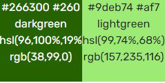

<h1 align="center">Coach Helper</h1>

[View the live project here.](#)

This is A website to help Fieldhockey coaches solve a real life problem with their coaching. 
I am a field hockey coach, and a problem that I kept running in to as well as most of my colleagues is the 
subbing(switching) of players and how to keep this as fair as possible. This website is designed to solve that problem 
by listing all the players and giving them stopwatches for both time played and  time on the bench.
accessibility is important because as coach you don't want to drag to much equipment around there for this website is 
designed to be able to work well on phone, tablet and computer. 

 image of site on different devices.

-   ### User stories

    -   #### First Time Visitor Goals

        1. As a First Time Visitor, I want to know what the site is about and how the site works.
        2. As a First Time Visitor, I want to have no trouble to find all the information and functions of the website therefore I want a clear cut navigation.
        3. As a First Time Visitor, I want to discover how the timer functions work.
        
    -   #### Returning Visitor Goals

        1. As a Returning Visitor, I want to use the timer function
        2. As a Returning Visitor, I want to be able to easily switch players timers from bench to field and vice versa. 
        3. As a Returning Visitor, I want to be able to make a players list.

    -   #### Frequent User Goals
        1. As a Frequent User, I want to see results of matches.  
        2. As a Frequent User, I want to store my team.
        3. As a Frequent User, I want to see additional functionality

-   ### Design
    -   #### Colour Scheme
        Within this website There are only 2 colors used. these are both variations of green. 
        The usages of only these 2 variations of green are to not distract the user of the functions of this website. 
        Green was used as main color for this is the color of most of the fields.

        <h2 align="center"></h2>
        
        For text the colours black and white were used. White was used for all the menubar buttons. 
        Black was used for all the content text.  
        To ensure that the site is usable for colorblind people the colors were tested with
        https://contrastchecker.com/.

        The color test - [View](assets/validation/my-wcag-color-samples.pdf)

-    #### Typography
        The Font-family's used on the website are 'Aldrich', with as back-up sans-serif and 'Roboto Slab', with  back-up serif.
        Aldrich is chosen for the menu-bar for its block/ bold typeface this gives it a Sporty look.
        Roboto Slab was chosen for its easily readability and modern style.
     
-    #### Imagery
    

-   ### Wireframes

    -  Wireframe for Coach helper - [View](assets/wireframes/wireframe pdf.pdf)